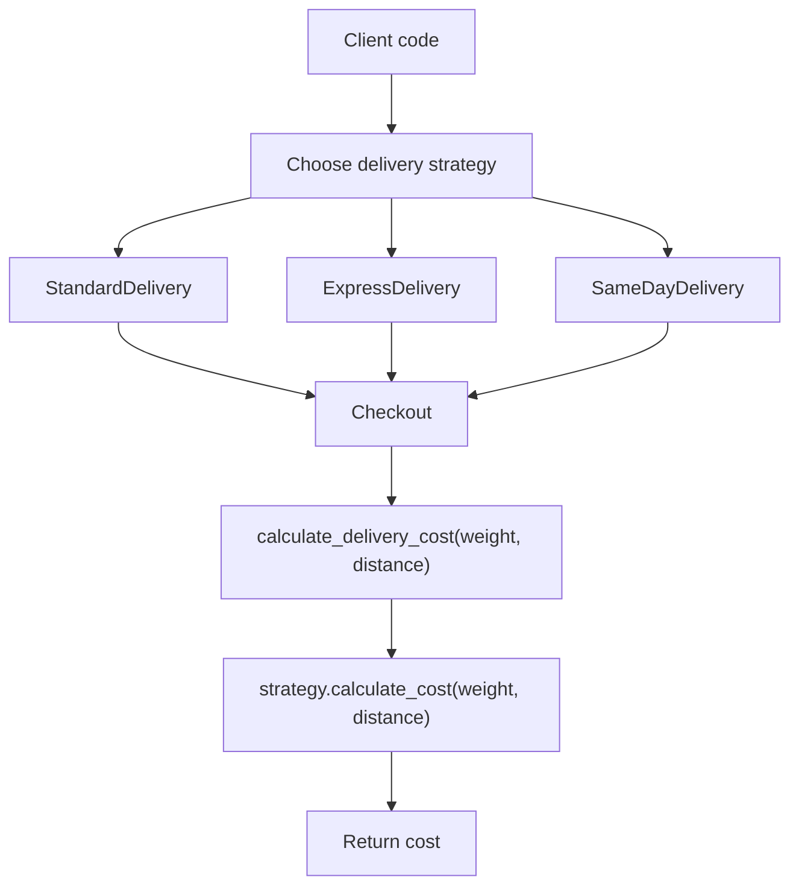
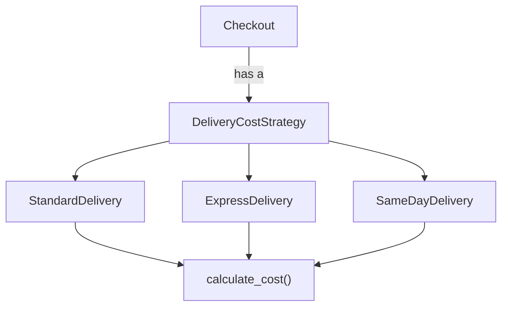

# Strategy Pattern Notes

Strategy pattern is used when an object has behavior that can change, and that
behavior should be selected or replaced without changing the main class.

## What

Strategy pattern defines a family of algorithms, puts each algorithm into a
separate class, and lets the main object use one of those algorithms through a
common interface.

Mental model:

```text
Context has a Strategy.
ConcreteStrategy decides how the behavior works.
```

Example:

```text
Checkout
- uses DeliveryCostStrategy

DeliveryCostStrategy
- StandardDelivery
- ExpressDelivery
- SameDayDelivery
```

The checkout does not know the exact delivery calculation. It only calls the
strategy.

## Why

Without Strategy, code often becomes full of conditionals:

```python
if delivery_type == "standard":
    cost = distance * 5
elif delivery_type == "express":
    cost = distance * 10
elif delivery_type == "same_day":
    cost = distance * 15
```

This becomes harder to maintain as more delivery types are added.

Problems:

- The checkout class has too many responsibilities.
- Adding a new algorithm requires changing existing code.
- It can break the Open/Closed Principle.
- Testing each behavior separately becomes harder.

Strategy fixes this by moving each algorithm into its own class.

## When

Use Strategy when:

- You have multiple ways to perform the same behavior.
- You want to switch behavior at runtime.
- You want to avoid large `if/else` or `match/case` blocks.
- The behavior changes independently from the main object.
- You want to follow composition over inheritance.

Good examples:

| Situation | Strategy |
| --- | --- |
| Checkout supports multiple delivery cost calculations | Delivery strategy |
| Payment can happen through UPI, card, or wallet | Payment strategy |
| A robot can have different walking/talking/flying behavior | Movement or speech strategy |
| A file compressor supports zip, gzip, and rar | Compression strategy |
| A sorting system supports quick sort, merge sort, and heap sort | Sorting strategy |

## Delivery Cost Example

Problem:

```text
Build a delivery cost calculator.

The checkout supports:
- standard delivery
- express delivery
- same-day delivery

Each delivery option calculates cost differently.
The checkout should not contain if/else logic for delivery type.
```

## Flowchart



## Class Relationship



## Code Snippet

Strategy interface:

```python
from abc import ABC, abstractmethod


class DeliveryCostStrategy(ABC):
    @abstractmethod
    def calculate_cost(self, weight: int, distance: int) -> float:
        ...
```

Concrete strategies:

```python
class StandardDelivery(DeliveryCostStrategy):
    def calculate_cost(self, weight: int, distance: int) -> float:
        return weight * distance


class ExpressDelivery(DeliveryCostStrategy):
    def calculate_cost(self, weight: int, distance: int) -> float:
        return weight * distance * 2


class SameDayDelivery(DeliveryCostStrategy):
    def calculate_cost(self, weight: int, distance: int) -> float:
        return weight * distance * 3
```

Context:

```python
class Checkout:
    def __init__(self, delivery_strategy: DeliveryCostStrategy):
        self.delivery_strategy = delivery_strategy

    def set_delivery_strategy(self, delivery_strategy: DeliveryCostStrategy):
        self.delivery_strategy = delivery_strategy

    def calculate_delivery_cost(self, weight: int, distance: int) -> float:
        return self.delivery_strategy.calculate_cost(weight, distance)
```

Client code:

```python
checkout = Checkout(StandardDelivery())
print(checkout.calculate_delivery_cost(12, 200))

checkout.set_delivery_strategy(ExpressDelivery())
print(checkout.calculate_delivery_cost(12, 200))

checkout.set_delivery_strategy(SameDayDelivery())
print(checkout.calculate_delivery_cost(12, 200))
```

## Important Discussion From Practice

Your first solution had the correct Strategy shape:

```python
class Delivery(ABC):
    @abstractmethod
    def deliver(self, weight: int, distance: int) -> float:
        ...


class StandardDelivery(Delivery):
    def deliver(self, weight, distance):
        return f"Standard delivery cost: {weight * distance}"


class Checkout:
    def checkout(self, delivery: Delivery, weight: int, distance: int):
        return delivery.deliver(weight, distance)
```

Why it was mostly correct:

- `Delivery` was the strategy interface.
- `StandardDelivery`, `ExpressDelivery`, and `SameDayDelivery` were concrete strategies.
- `Checkout` did not have `if/else` logic.
- The behavior was passed from outside.

Improvements:

- Use behavior-focused names like `calculate_cost()` instead of `deliver()`.
- Keep return types consistent. If the method says it returns `float`, return a number, not a string.
- Let the strategy calculate; let client code decide how to print.
- Store the strategy inside the context if you want runtime replacement to be clear.

## Strategy vs Factory

This is an important difference:

```text
Factory pattern:
Which object should I create?

Strategy pattern:
Which behavior or algorithm should this object use?
```

Factory is about object creation.

Strategy is about behavior selection.

## Final Memory Hook

```text
Use Strategy when the algorithm varies.

Put each algorithm in its own class.

The context should use the strategy through an interface.

Changing behavior should not require changing the context.
```
