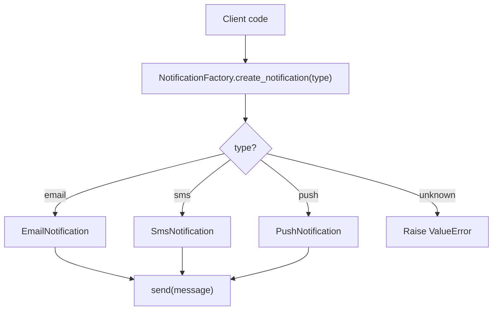
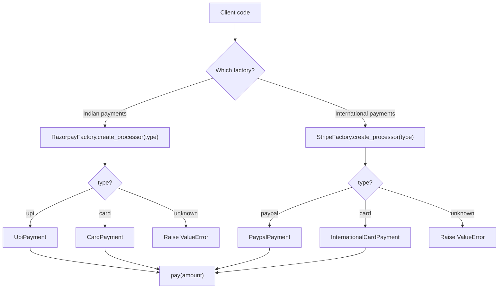
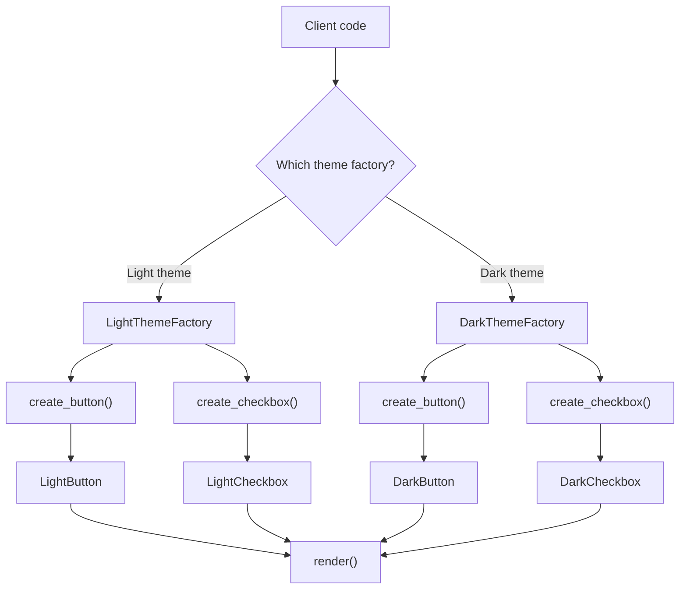
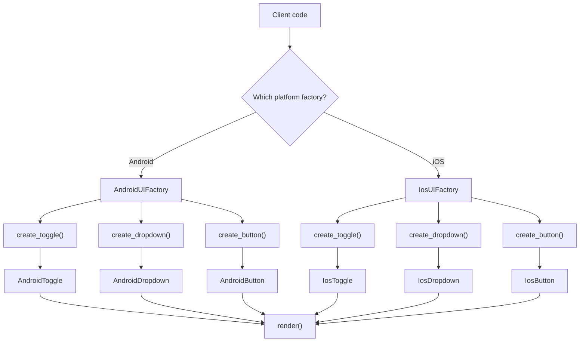

# Factory Design Pattern Notes

Factory patterns help separate business logic from object creation logic.

Instead of writing object creation logic everywhere:

```python
notification = EmailNotification()
```

the client asks a factory for the object:

```python
notification = NotificationFactory.create_notification("email")
```

This keeps the client code dependent on an interface or abstract class, not on
concrete implementations.

## Core Idea

Use a factory when the client should not know which concrete class it is creating.

The client asks for something like `"email"`, `"sms"`, `"upi"`, `"card"`, or
`"dark"` and receives an object that follows a common interface.

## Simple Factory

Use simple factory when:

- You have one product type.
- You have multiple implementations of that product.
- A simple input value decides which implementation to create.

Example:

```text
Notification
- EmailNotification
- SmsNotification
- PushNotification
```

The client asks:

```python
notification = NotificationFactory.create_notification("email")
```

The factory returns:

```python
EmailNotification()
```

Flowchart:



Mental model:

```text
One product type, many variants.
```

## Factory Method

Use factory method when:

- You still create one product type.
- But the creator/factory itself changes.
- Each creator decides which concrete class to instantiate.

Example:

```text
PaymentFactory
- RazorpayFactory
  - UpiPayment
  - CardPayment

- StripeFactory
  - PaypalPayment
  - InternationalCardPayment
```

The client can use different factories:

```python
payment = RazorpayFactory.create_processor("upi")
payment = StripeFactory.create_processor("card")
```

Flowchart:



Mental model:

```text
One product type, but multiple creator classes.
```

## Abstract Factory

Use abstract factory when:

- You need to create multiple related product types.
- Those products should belong to the same family.
- Objects from the same factory should be compatible with each other.

Example:

```text
LightThemeFactory
- LightButton
- LightCheckbox

DarkThemeFactory
- DarkButton
- DarkCheckbox
```

The client asks one factory for related objects:

```python
button = DarkThemeFactory.create_button()
checkbox = DarkThemeFactory.create_checkbox()
```

Flowchart:



Mental model:

```text
Multiple product types, grouped by family.
```

## How To Choose

Ask this first:

```text
Am I creating one object type or a family of related object types?
```

If creating one object type:

- Use simple factory if one factory chooses the implementation using a type/config.
- Use factory method if different creator classes decide what to create.

If creating multiple related object types:

- Use abstract factory.

Quick comparison:

| Situation | Pattern |
| --- | --- |
| Based on `"email"`, `"sms"`, or `"push"`, create one `Notification` | Simple Factory |
| Razorpay and Stripe both create `PaymentProcessor`, but differently | Factory Method |
| Light theme creates `LightButton` + `LightCheckbox` | Abstract Factory |
| Based on `"car"`, `"bike"`, or `"truck"`, create one `Vehicle` | Simple Factory |
| AWS and Azure create matching `Storage` + `Queue` + `Database` | Abstract Factory |

## Important Implementation Detail

Prefer mapping input values to classes, then instantiate after selection.

Good:

```python
notification_map = {
    "email": EmailNotification,
    "sms": SmsNotification,
    "push": PushNotification,
}

notification_class = notification_map.get(notification_type.lower())

if notification_class is None:
    raise ValueError("Invalid Notification Type")

return notification_class()
```

Avoid creating all objects upfront:

```python
notification_map = {
    "email": EmailNotification(),
    "sms": SmsNotification(),
    "push": PushNotification(),
}
```

Why?

- It creates objects even if they are not needed.
- It can waste memory or setup time.
- It can cause unwanted side effects if object construction does real work.
- Returning a fresh object is usually cleaner.

## Final Memory Hook

```text
Simple Factory:
One factory chooses one product variant.

Factory Method:
Different factories choose one product variant.

Abstract Factory:
One factory creates a matching family of products.
```

## Practice Discussion: Android and iOS UI Factory

Problem:

```text
Build a notification settings screen for Android and iOS.
Each platform needs a toggle, dropdown, and button.
The client code should not directly create Android or iOS classes.
```

The first design used generic components like `Toggle`, `Dropdown`, and
`Button`, then passed `"Android"` or `"iOS"` as a string.

That was not a proper Abstract Factory yet because the platform-specific
behavior was coming from a parameter, not from separate platform-specific
objects.

Less ideal:

```python
class Toggle:
    def render(self, prefix: str):
        print(f"Rendering {prefix} toggle")


Toggle().render("Android")
```

The better direction is to create actual platform-specific products:

```python
class AndroidToggle(Element):
    def render(self):
        print("Rendering Android toggle")


class IosToggle(Element):
    def render(self):
        print("Rendering iOS toggle")
```

Then the factory creates a matching family:

```python
class UIFactory(ABC):
    @abstractmethod
    def get_toggle(self):
        ...

    @abstractmethod
    def get_dropdown(self):
        ...

    @abstractmethod
    def get_button(self):
        ...
```

Concrete Android factory:

```python
class AndroidUIFactory(UIFactory):
    def get_toggle(self):
        return AndroidToggle()

    def get_dropdown(self):
        return AndroidDropdown()

    def get_button(self):
        return AndroidButton()
```

Concrete iOS factory:

```python
class IosUIFactory(UIFactory):
    def get_toggle(self):
        return IosToggle()

    def get_dropdown(self):
        return IosDropdown()

    def get_button(self):
        return IosButton()
```

This is Abstract Factory because:

- `UIFactory` defines methods for creating a family of related products.
- `AndroidUIFactory` creates the Android family.
- `IosUIFactory` creates the iOS family.
- Client code can use a factory without directly creating concrete UI classes.

Better naming:

```python
get_toggle()
get_dropdown()
get_button()
```

works, but this is more explicit:

```python
create_toggle()
create_dropdown()
create_button()
```

because the factory is creating objects, not rendering them.

Also avoid doing render work inside `__init__`:

```python
class AndroidUIFactory(UIFactory):
    def __init__(self):
        print("Rendering Android notification settings")
```

The factory should create objects. The client should decide when to render or
print screen-level messages.

Flowchart:



Final learning from this exercise:

```text
If platform/type is only a string passed into a generic class, it is probably
not Abstract Factory yet.

For Abstract Factory, create real related product families and let each factory
return the matching family.
```
